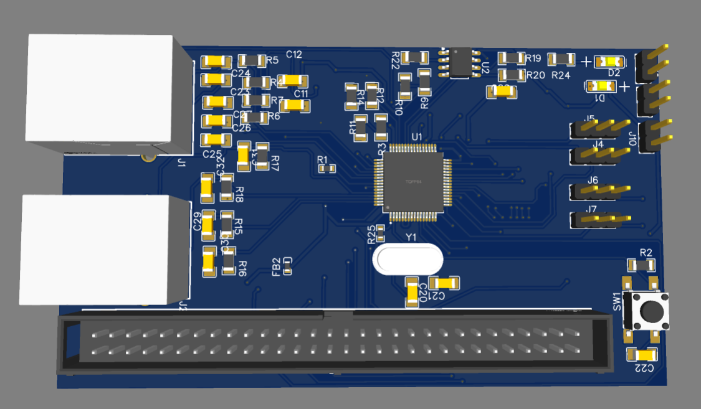
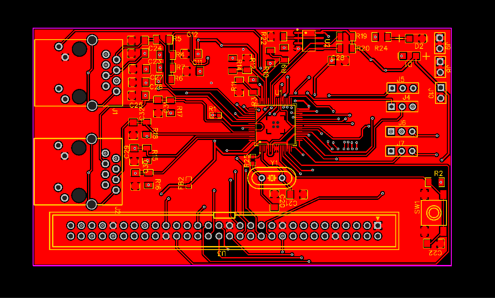

# LAN9252 EtherCAT SPI Evaluation Board

Welcome to my hardware design repository! This project contains the complete, production-ready PCB design files for an EtherCAT Slave Evaluation Board. 

I designed this board around the Microchip LAN9252, a highly reliable 2/3-port EtherCAT slave controller. The goal was to create a robust, easy-to-use development platform for integrating real-time EtherCAT communication into embedded systems via a standard SPI interface.

  

## 🚀 Project Overview

If you are looking to build industrial automation devices or robotics controllers that require EtherCAT, this board is the perfect starting point. It acts as a bridge between an EtherCAT network and any host microcontroller (like an STM32, ESP32, or PIC) using a high-speed SPI bus.

I've made sure this design is completely manufacturing-ready. You don't need to tweak anything—just grab the Gerber files, upload them to your favorite PCB manufacturer (like JLCPCB or PCBWay), and you're good to go.

### Key Hardware Features
- **Core Controller:** Microchip LAN9252I/PT (TQFP-64 package)
- **Network Interface:** Dual RJ45 Ethernet ports supporting standard EtherCAT daisy-chain topology (Port 0 for IN, Port 1 for OUT).
- **Host Interface:** Standard SPI, easily connected to almost any MCU.
- **EEPROM Storage:** Includes a 512Kbit I²C EEPROM (24FC512) for storing the critical EtherCAT Slave Information Interface (SII) configuration data.
- **Clock:** Precision 25 MHz crystal oscillator.
- **Expansion:** A massive 60-pin header (2.54mm pitch) that breaks out all necessary LAN9252 GPIOs, SPI lines, and control signals.
- **User Interface:** Onboard Link/Activity status LEDs and a dedicated hardware reset tactile switch.

## 📐 Design Specifications & Layout

This is a compact, cost-effective 2-layer PCB designed in EasyEDA. During the design process, I paid special attention to signal integrity:
*   Extensive power decoupling (0.1µF and 1µF capacitors) right at the LAN9252 power pins.
*   49.9Ω series resistors on the Ethernet PHY differential pairs for impedance matching.
*   Ferrite beads on the power rails to suppress high-frequency EMI noise.

  
  &nbsp;
  

## 📂 What's in this Repository?

Everything you need to study, modify, or manufacture this board is included here:

*   **Schematics:** Available in high-resolution PDF format.
*   **PCB Layouts:** Top and bottom layer images, plus detailed PDFs.
*   **Manufacturing Files:** A ready-to-order ZIP file containing all necessary Gerber and Drill files.
*   **BOM:** A complete Bill of Materials (CSV) with LCSC part numbers for easy component sourcing.
*   **3D Models:** OBJ files and rendered images showing exactly how the final assembled board will look.

## 🛠️ How to Manufacture and Use

**1. Ordering the PCB**
Download the `Gerber_EVB_LAN9252_SPI_PCB_EVB_LAN9252_SPI_2026-04-24.zip` file. Go to a manufacturer like JLCPCB, upload the ZIP, select a 2-layer 1.6mm board, and place your order. (I recommend a blue solder mask to match the 3D renders!)

**2. Assembly & Setup**
Once you have the board and components (use the provided BOM), solder everything together. 

**3. Software Configuration**
Before the board will talk to an EtherCAT master, you must program the onboard 24FC512 EEPROM with your specific EtherCAT SII data using the Microchip EtherCAT Configuration Tool.

**4. Interfacing**
Connect the SPI pins from the 60-pin header to your microcontroller. Plug your Ethernet cables into the RJ45 ports, power the board with a clean 3.3V supply, and your EtherCAT Master (like TwinCAT) should discover the slave node!

## 📄 License

This hardware design is open-source and released under the **MIT License**. Feel free to use it, learn from it, or integrate it into your own commercial products.

## 👨‍💻 About the Author

**Ram Axay**
*Electronics & Communication Engineering Graduate | Embedded Systems Engineer*

I'm passionate about hardware design, embedded systems, and industrial automation. If you find this design helpful for your own projects, I'd really appreciate it if you clicked the ⭐ Star button at the top of the repository!

🔗 [Follow me on GitHub](https://github.com/ramaxay)
