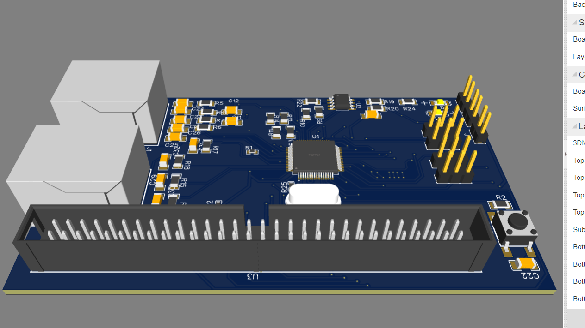
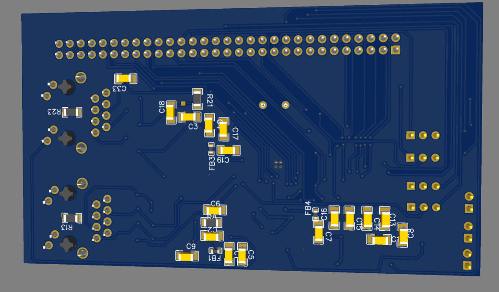
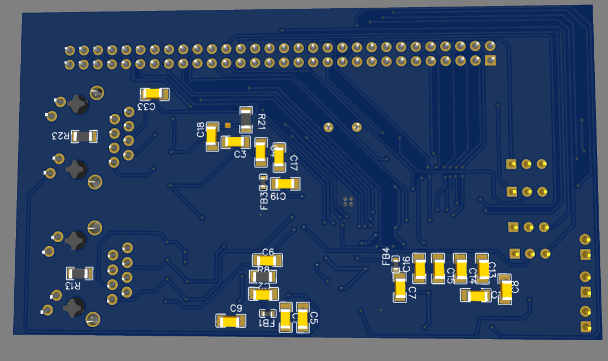

# LAN9252 EtherCAT SPI — Evaluation Board PCB Design

<p align="center">
  
</p>

<p align="center">
  <b>Production-Ready EtherCAT Slave Evaluation Board based on Microchip LAN9252 with SPI Interface</b>
</p>

<p align="center">
  <a href="#features"></a>
  <a href="#license"></a>
  <a href="#eda-tool"></a>
  <a href="#board-specs"></a>
</p>

---

## 📋 Table of Contents

- [Overview](#overview)
- [Features](#features)
- [Board Specifications](#board-specs)
- [3D Renders](#3d-renders)
- [PCB Layout](#pcb-layout)
- [Schematic](#schematic)
- [Bill of Materials (BOM)](#bill-of-materials-bom)
- [Key Components](#key-components)
- [Repository Structure](#repository-structure)
- [How to Order PCB](#how-to-order-pcb)
- [How to Use](#how-to-use)
- [Design Considerations](#design-considerations)
- [License](#license)
- [Author](#author)

---

## Overview

This repository contains the **complete PCB design files** for an **EtherCAT Slave Evaluation Board** based on the **Microchip LAN9252** — a 2/3-port EtherCAT slave controller with integrated Ethernet PHYs. The board communicates with a host microcontroller via the **SPI interface**, making it ideal for integrating real-time EtherCAT communication into embedded systems.

The design is **production-ready** with all necessary manufacturing files (Gerber, BOM, Pick & Place) included, and can be directly ordered from PCB fabrication services such as **JLCPCB**, **PCBWay**, or **AllPCB**.

---

## Features

- ✅ **Microchip LAN9252I/PT** — EtherCAT Slave Controller (TQFP-64)
- ✅ **Dual RJ45 Ethernet Ports** — Daisy-chain topology support (IN/OUT)
- ✅ **SPI Host Interface** — High-speed communication with host MCU
- ✅ **24FC512 EEPROM** — 512Kbit I²C EEPROM for EtherCAT SII (Slave Information Interface)
- ✅ **25 MHz Crystal Oscillator** — Precision clock source
- ✅ **60-Pin Header Connector** — Full breakout of LAN9252 GPIOs, SPI, and control signals
- ✅ **Status LEDs** — Link/Activity indication
- ✅ **Reset Button** — Hardware reset via tactile switch
- ✅ **Configurable Jumpers** — Mode selection and configuration headers
- ✅ **Compact 2-Layer Design** — Cost-effective manufacturing

---

<a id="board-specs"></a>
## 📐 Board Specifications

| Parameter             | Value                              |
|-----------------------|------------------------------------|
| **Main IC**           | LAN9252I/PT (Microchip)            |
| **EEPROM**            | 24FC512T-I/SN (512Kbit, I²C)      |
| **Interface**         | SPI (to host MCU)                  |
| **Ethernet Ports**    | 2× RJ45 (Dual-port EtherCAT)      |
| **PCB Layers**        | 2-Layer                            |
| **EDA Tool**          | EasyEDA                            |
| **Crystal**           | 25 MHz (HC-49S)                    |
| **Connector**         | 2×30 Pin Header (2.54mm pitch)     |
| **Supply Voltage**    | 3.3V                               |
| **Component Package** | Mixed SMD (0603/1206) + THT        |

---

## 3D Renders

<p align="center">
  
  &nbsp;
  
</p>

<p align="center">
  
  &nbsp;
  
</p>

---

## PCB Layout

| Top Layer | Bottom Layer |
|:---------:|:------------:|
|  |  |

> Full PCB layout documentation is available in [`PCB_PCB_EVB_LAN9252_SPI_2026-04-24.pdf`](PCB_PCB_EVB_LAN9252_SPI_2026-04-24.pdf)

---

## Schematic

The complete schematic is available as a PDF:

📄 **[View Schematic (PDF)](Schematic_EVB_LAN9252_SPI_2026-04-24.pdf)**

Key schematic sections include:
- LAN9252 core circuit with power decoupling
- Dual RJ45 Ethernet interface with magnetics
- SPI host interface breakout
- EEPROM (24FC512) I²C connection
- 25 MHz crystal oscillator circuit
- Status LED indicators
- Reset circuitry

---

## Bill of Materials (BOM)

| # | Component | Designator | Footprint | Qty | LCSC Part |
|---|-----------|-----------|-----------|-----|-----------|
| 1 | LAN9252I/PT | U1 | TQFP-64 | 1 | C80933 |
| 2 | 24FC512T-I/SN | U2 | SOIC-8 | 1 | C615659 |
| 3 | 25 MHz Crystal | Y1 | HC-49S | 1 | C470253 |
| 4 | RJ45 Connector | J1, J2 | Through-Hole | 2 | C5154036 |
| 5 | 60-Pin Header | U3 | 2×30 2.54mm | 1 | C19193817 |
| 6 | 0.1µF Capacitor | C2, C4–C12, C15–C16, C18–C19, C22 | 1206 | 14 | — |
| 7 | 1µF Capacitor | C1, C3, C6, C17 | 1206 | 4 | — |
| 8 | 10pF Capacitor | C23–C27, C29–C33 | 1206 | 10 | — |
| 9 | 49.9Ω Resistor | R4–R7, R15–R18 | 1206 | 8 | — |
| 10 | Ferrite Bead | FB1–FB4 | 0603 | 4 | C85827 |
| 11 | Status LEDs | D1, D2 | 1206 | 2 | C7496852 |
| 12 | Tactile Switch | SW1 | SMD 4-Pin | 1 | C9900003126 |

> 📄 Full BOM: [`BOM_EVB_LAN9252_SPI_2026-04-24.csv`](BOM_EVB_LAN9252_SPI_2026-04-24.csv)

---

## Key Components

### Microchip LAN9252
The LAN9252 is a 2/3-port EtherCAT slave controller with dual integrated Ethernet PHYs, compliant with the EtherCAT standard (IEC 61158). It supports multiple host interfaces including SPI, SQI, and parallel buses, enabling seamless integration with a wide range of microcontrollers.

### 24FC512 EEPROM
A 512Kbit serial EEPROM connected via I²C, used to store the EtherCAT Slave Information Interface (SII) data. This non-volatile memory holds the slave's identity, PDO mapping, and configuration parameters required during EtherCAT network initialization.

---

## 📁 Repository Structure

```
LAN9252-EtherCAT-SPI-EVB/
│
├── README.md                                          # This file
├── LICENSE                                            # License file
├── .gitignore                                         # Git ignore rules
│
├── Schematic_EVB_LAN9252_SPI_2026-04-24.pdf           # Full schematic (PDF)
├── PCB_PCB_EVB_LAN9252_SPI_2026-04-24.pdf             # PCB layout documentation (PDF)
├── BOM_EVB_LAN9252_SPI_2026-04-24.csv                 # Bill of Materials
│
├── PCB_PCB_EVB_LAN9252_SPI_2026-04-24.png             # PCB layout image (Top)
├── back PCB_PCB_EVB_LAN9252_SPI_2026-04-24.png        # PCB layout image (Bottom)
│
├── 3d(1).png                                          # 3D render — Perspective view
├── 3d(2).png                                          # 3D render — Top view
├── 3d(3).png                                          # 3D render — Bottom view
├── 3d(4).png                                          # 3D render — Angle view
│
├── Gerber_EVB_LAN9252_SPI_PCB_EVB_LAN9252_SPI_2026-04-24/
│   ├── Gerber_TopLayer.GTL                            # Top copper layer
│   ├── Gerber_BottomLayer.GBL                         # Bottom copper layer
│   ├── Gerber_TopSilkscreenLayer.GTO                  # Top silkscreen
│   ├── Gerber_BottomSilkscreenLayer.GBO               # Bottom silkscreen
│   ├── Gerber_TopSolderMaskLayer.GTS                  # Top solder mask
│   ├── Gerber_BottomSolderMaskLayer.GBS               # Bottom solder mask
│   ├── Gerber_TopPasteMaskLayer.GTP                   # Top paste mask
│   ├── Gerber_BottomPasteMaskLayer.GBP                # Bottom paste mask
│   ├── Gerber_BoardOutlineLayer.GKO                   # Board outline
│   ├── Gerber_DocumentLayer.GDL                       # Document layer
│   ├── Drill_PTH_Through.DRL                          # Plated through-hole drill
│   ├── Drill_PTH_Through_Via.DRL                      # Via drill
│   ├── Drill_NPTH_Through.DRL                         # Non-plated through-hole drill
│   └── How-to-order-PCB.txt                           # Ordering instructions
│
├── Gerber_EVB_LAN9252_SPI_PCB_EVB_LAN9252_SPI_2026-04-24.zip  # Gerber (zipped, ready to order)
│
├── OBJ_PCB_EVB_LAN9252_SPI_2026-04-24/               # 3D model files
│   ├── OBJ_PCB_EVB_LAN9252_SPI.obj                   # 3D model (OBJ format)
│   └── OBJ_PCB_EVB_LAN9252_SPI.mtl                   # Material file
│
└── OBJ_PCB_EVB_LAN9252_SPI_2026-04-24.zip            # 3D model (zipped)
```

---

## �icing How to Order PCB

1. **Download** the Gerber ZIP file: `Gerber_EVB_LAN9252_SPI_PCB_EVB_LAN9252_SPI_2026-04-24.zip`
2. Go to [JLCPCB](https://jlcpcb.com/) or [PCBWay](https://www.pcbway.com/)
3. Click **"Quote Now"** or **"Instant Quote"**
4. Upload the Gerber ZIP file
5. Select the following parameters:
   - **Layers:** 2
   - **PCB Thickness:** 1.6mm
   - **Surface Finish:** HASL (Lead-free) or ENIG
   - **Solder Mask Color:** Blue (to match 3D renders)
   - **Silkscreen:** White
6. Review the Gerber preview and place your order

---

## 🔧 How to Use

1. **Solder all components** as per the BOM and schematic
2. **Program the EEPROM** (24FC512) with EtherCAT SII data using the Microchip EtherCAT Configuration Tool
3. **Connect the SPI interface** to your host MCU (STM32, ESP32, etc.)
4. **Connect Ethernet cables** to the RJ45 ports (Port 0 = IN, Port 1 = OUT for daisy-chaining)
5. **Power the board** with 3.3V supply
6. **Configure the EtherCAT Master** (TwinCAT, SOEM, etc.) to detect the slave

---

## Design Considerations

- **Decoupling:** Extensive bypass capacitance (0.1µF + 1µF) placed close to LAN9252 power pins
- **Impedance Matching:** 49.9Ω series resistors on Ethernet PHY differential pairs
- **EMI Filtering:** Ferrite beads (BLM18EG221SN1D) on power rails for noise suppression
- **Signal Integrity:** Short, direct traces for SPI and Ethernet differential pairs
- **ESD Protection:** RJ45 connectors with integrated magnetics

---

## 📝 License

This project is licensed under the **MIT License** — see the [LICENSE](LICENSE) file for details.

You are free to use, modify, and distribute this design for both personal and commercial purposes.

---

## 👤 Author

**Ram Axay**

- 🎓 Electronics & Communication Engineering Graduate
- 💼 Embedded Systems Engineer
- 🔗 [GitHub Profile](https://github.com/ramaxay)

---

<p align="center">
  <i>If this project helped you, please consider giving it a ⭐ on GitHub!</i>
</p>
